# HomeLab Platform – Architektura řešení

> Dokument popisuje architektonický návrh a vývojovou cestu HomeLab platformy –  
> monitorovacího dashboardu pro privátní Kubernetes cluster na Raspberry Pi.

---

## Hardware

<table style="border-collapse: collapse; width: 100%; border-radius: 8px; overflow: hidden; border: 1px solid #7c3aed;">
  <tr>
    <th colspan="2" style="background: linear-gradient(135deg, #3b0764 0%, #4c1d95 40%, #374151 100%); color: #f5f3ff; padding: 14px 20px; text-align: center; font-size: 1.05em; letter-spacing: 0.08em; text-transform: uppercase;">Fyzický cluster</th>
  </tr>
  <tr style="background: #111827;">
    <td style="padding: 8px;">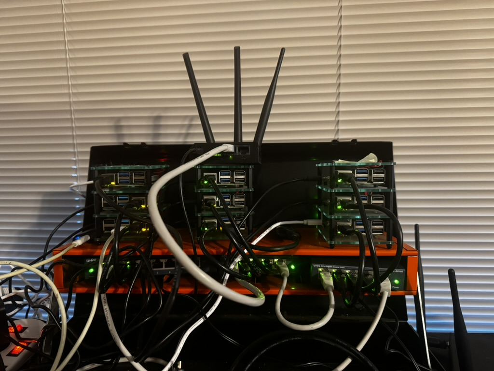</td>
    <td style="padding: 8px;"></td>
  </tr>
</table>

---

## Obsah

1. [Executive Summary](#1-executive-summary)
2. [High-Level Architecture](#2-high-level-architecture)
3. [Infrastrukturní vrstva](#3-infrastrukturní-vrstva)
4. [Aplikační vrstva](#4-aplikační-vrstva)
5. [Datová vrstva](#5-datová-vrstva)
6. [Platform Services](#6-platform-services)
7. [CI/CD Pipeline](#7-cicd-pipeline)
8. [Observability](#8-observability)
9. [Security](#9-security)
10. [Backup & Recovery](#10-backup--recovery)
11. [Resilience & High Availability](#11-resilience--high-availability)
12. [Vývojová cesta – Fáze](#12-vývojová-cesta--fáze)

---

## 1. Executive Summary

HomeLab Platform je end-to-end řešení pro monitoring privátního Kubernetes clusteru. Projekt vznikl jako praktický učební rámec pro zvládnutí celého enterprise stacku – od REST API přes kontejnerizaci a orchestraci až po CI/CD a provozní procesy.

**Klíčové charakteristiky:**

| Atribut | Hodnota |
|---|---|
| Deployment model | On-premises Kubernetes (ARM64) |
| Architektonický styl | Microservices, API-first |
| Frontend | Single-Page Application |
| Backend | RESTful API |
| Persistance | Relační DB + in-memory cache + time-series |
| CI/CD | GitOps-inspired, self-hosted pipeline |
| Provozní model | Infrastructure as Code (Kustomize) |

---

## 2. High-Level Architecture

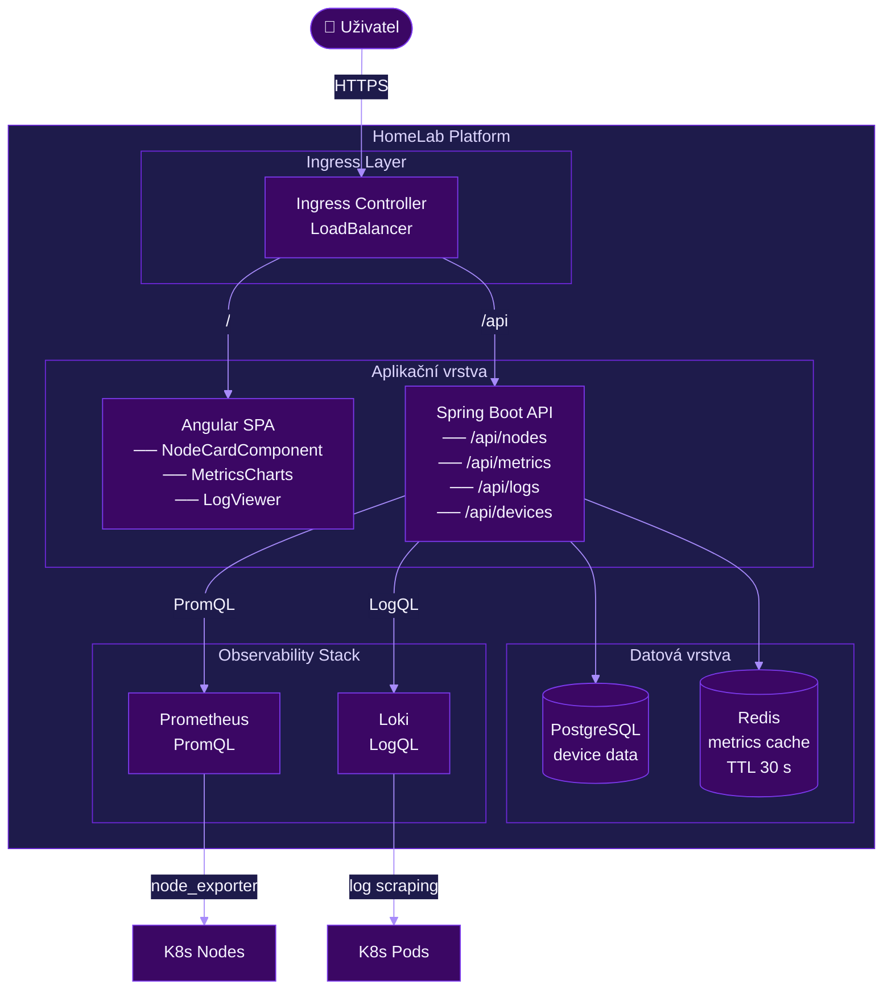
```mermaid
%%{init: {'theme': 'base', 'themeVariables': {'primaryColor': '#3b0764', 'primaryTextColor': '#f5f3ff', 'primaryBorderColor': '#7c3aed', 'lineColor': '#a78bfa', 'secondaryColor': '#1f2937', 'tertiaryColor': '#111827', 'clusterBkg': '#1e1b4b', 'clusterBorder': '#6d28d9', 'nodeBorder': '#7c3aed', 'titleColor': '#ddd6fe', 'edgeLabelBackground': '#1e1b4b', 'actorBkg': '#3b0764', 'actorBorder': '#7c3aed', 'actorTextColor': '#f5f3ff', 'actorLineColor': '#6d28d9', 'signalColor': '#a78bfa', 'signalTextColor': '#f5f3ff', 'noteBkgColor': '#2e1065', 'noteTextColor': '#ddd6fe', 'labelBoxBkgColor': '#3b0764', 'labelBoxBorderColor': '#7c3aed', 'labelTextColor': '#f5f3ff', 'loopTextColor': '#ddd6fe', 'activationBorderColor': '#7c3aed', 'activationBkgColor': '#2e1065', 'sequenceNumberColor': '#f5f3ff'}}}%%
graph TB
    User(["👤 Uživatel"])

    subgraph Platform["HomeLab Platform"]
        direction TB

        subgraph Ingress["Ingress Layer"]
            IC["Ingress Controller\nLoadBalancer"]
        end

        subgraph App["Aplikační vrstva"]
            UI["Angular SPA\n── NodeCardComponent\n── MetricsCharts\n── LogViewer"]
            API["Spring Boot API\n── /api/nodes\n── /api/metrics\n── /api/logs\n── /api/devices"]
        end

        subgraph Data["Datová vrstva"]
            PG[("PostgreSQL\ndevice data")]
            Redis[("Redis\nmetrics cache\nTTL 30 s")]
        end

        subgraph Obs["Observability Stack"]
            Prom["Prometheus\nPromQL"]
            Loki["Loki\nLogQL"]
        end
    end

    User -->|HTTPS| IC
    IC -->|"/"| UI
    IC -->|"/api"| API
    API --> PG
    API --> Redis
    API -->|PromQL| Prom
    API -->|LogQL| Loki
    Prom -->|node_exporter| Nodes["K8s Nodes"]
    Loki -->|log scraping| Pods["K8s Pods"]
```

### Tok požadavku – metriky

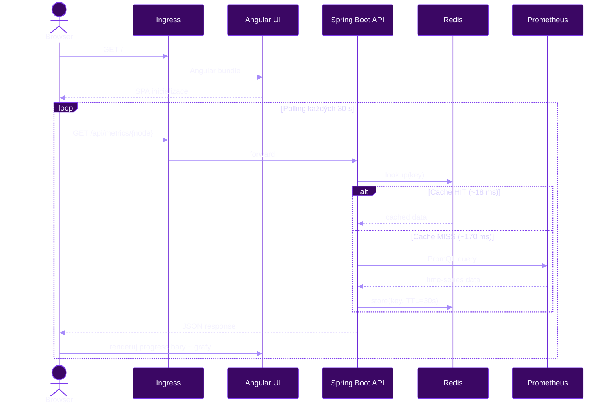
```mermaid
%%{init: {'theme': 'base', 'themeVariables': {'primaryColor': '#3b0764', 'primaryTextColor': '#f5f3ff', 'primaryBorderColor': '#7c3aed', 'lineColor': '#a78bfa', 'secondaryColor': '#1f2937', 'tertiaryColor': '#111827', 'clusterBkg': '#1e1b4b', 'clusterBorder': '#6d28d9', 'nodeBorder': '#7c3aed', 'titleColor': '#ddd6fe', 'edgeLabelBackground': '#1e1b4b', 'actorBkg': '#3b0764', 'actorBorder': '#7c3aed', 'actorTextColor': '#f5f3ff', 'actorLineColor': '#6d28d9', 'signalColor': '#a78bfa', 'signalTextColor': '#f5f3ff', 'noteBkgColor': '#2e1065', 'noteTextColor': '#ddd6fe', 'labelBoxBkgColor': '#3b0764', 'labelBoxBorderColor': '#7c3aed', 'labelTextColor': '#f5f3ff', 'loopTextColor': '#ddd6fe', 'activationBorderColor': '#7c3aed', 'activationBkgColor': '#2e1065', 'sequenceNumberColor': '#f5f3ff'}}}%%
sequenceDiagram
    actor Browser
    participant Ingress
    participant UI as Angular UI
    participant API as Spring Boot API
    participant Cache as Redis
    participant Prom as Prometheus

    Browser->>Ingress: GET /
    Ingress->>UI: Angular bundle
    UI-->>Browser: SPA inicializace

    loop Polling každých 30 s
        Browser->>Ingress: GET /api/metrics/{node}
        Ingress->>API: forward
        API->>Cache: lookup(key)
        alt Cache HIT  (~18 ms)
            Cache-->>API: cached data
        else Cache MISS  (~170 ms)
            API->>Prom: PromQL query
            Prom-->>API: time-series data
            API->>Cache: store(key, TTL=30s)
        end
        API-->>Browser: JSON response
        Browser->>UI: renderuj progress bary + grafy
    end
```

---

## 3. Infrastrukturní vrstva

### Topologie clusteru

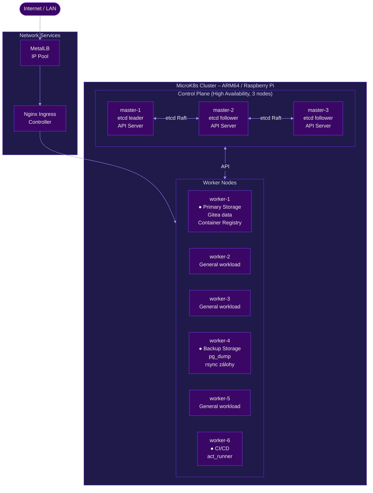
```mermaid
%%{init: {'theme': 'base', 'themeVariables': {'primaryColor': '#3b0764', 'primaryTextColor': '#f5f3ff', 'primaryBorderColor': '#7c3aed', 'lineColor': '#a78bfa', 'secondaryColor': '#1f2937', 'tertiaryColor': '#111827', 'clusterBkg': '#1e1b4b', 'clusterBorder': '#6d28d9', 'nodeBorder': '#7c3aed', 'titleColor': '#ddd6fe', 'edgeLabelBackground': '#1e1b4b', 'actorBkg': '#3b0764', 'actorBorder': '#7c3aed', 'actorTextColor': '#f5f3ff', 'actorLineColor': '#6d28d9', 'signalColor': '#a78bfa', 'signalTextColor': '#f5f3ff', 'noteBkgColor': '#2e1065', 'noteTextColor': '#ddd6fe', 'labelBoxBkgColor': '#3b0764', 'labelBoxBorderColor': '#7c3aed', 'labelTextColor': '#f5f3ff', 'loopTextColor': '#ddd6fe', 'activationBorderColor': '#7c3aed', 'activationBkgColor': '#2e1065', 'sequenceNumberColor': '#f5f3ff'}}}%%
graph TB
    subgraph Cluster["MicroK8s Cluster  –  ARM64 / Raspberry Pi"]
        direction TB

        subgraph CP["Control Plane  (High Availability, 3 nodes)"]
            M1["master-1\netcd leader\nAPI Server"]
            M2["master-2\netcd follower\nAPI Server"]
            M3["master-3\netcd follower\nAPI Server"]
            M1 <-->|etcd Raft| M2
            M2 <-->|etcd Raft| M3
        end

        subgraph Workers["Worker Nodes"]
            W1["worker-1\n● Primary Storage\n  Gitea data\n  Container Registry"]
            W2["worker-2\nGeneral workload"]
            W3["worker-3\nGeneral workload"]
            W4["worker-4\n● Backup Storage\n  pg_dump\n  rsync zálohy"]
            W5["worker-5\nGeneral workload"]
            W6["worker-6\n● CI/CD\n  act_runner"]
        end
    end

    subgraph Net["Network Services"]
        MLBPool["MetalLB\nIP Pool"]
        IC["Nginx Ingress\nController"]
    end

    Internet(["Internet / LAN"]) --> MLBPool
    MLBPool --> IC
    IC --> Workers
    CP <-->|API| Workers
```

### Síťová architektura

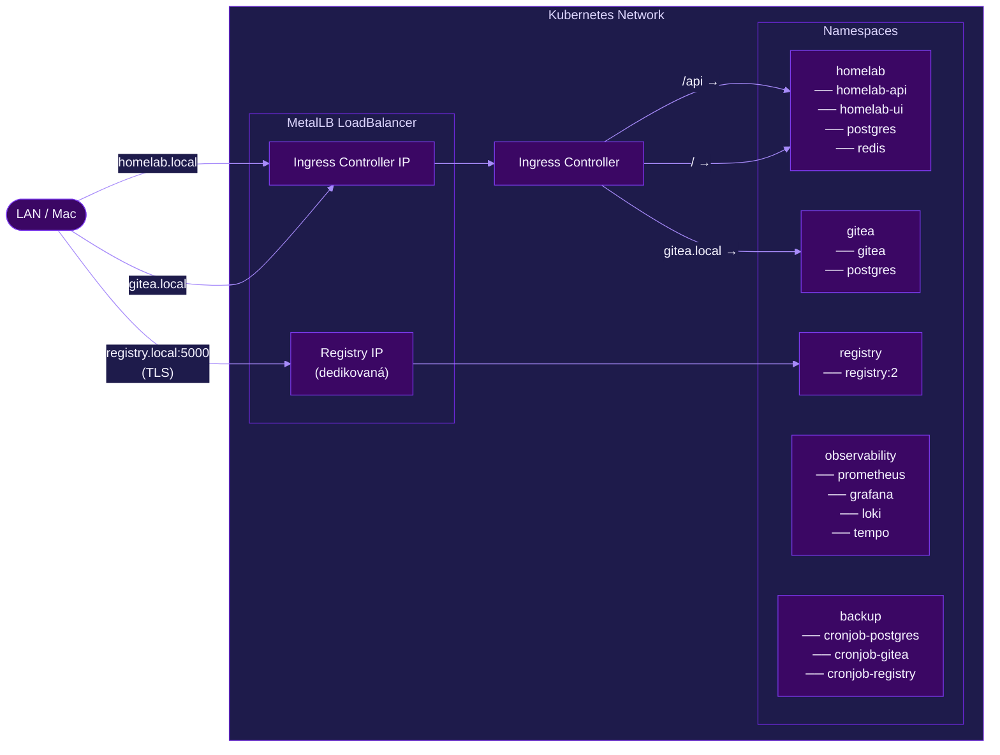
```mermaid
%%{init: {'theme': 'base', 'themeVariables': {'primaryColor': '#3b0764', 'primaryTextColor': '#f5f3ff', 'primaryBorderColor': '#7c3aed', 'lineColor': '#a78bfa', 'secondaryColor': '#1f2937', 'tertiaryColor': '#111827', 'clusterBkg': '#1e1b4b', 'clusterBorder': '#6d28d9', 'nodeBorder': '#7c3aed', 'titleColor': '#ddd6fe', 'edgeLabelBackground': '#1e1b4b', 'actorBkg': '#3b0764', 'actorBorder': '#7c3aed', 'actorTextColor': '#f5f3ff', 'actorLineColor': '#6d28d9', 'signalColor': '#a78bfa', 'signalTextColor': '#f5f3ff', 'noteBkgColor': '#2e1065', 'noteTextColor': '#ddd6fe', 'labelBoxBkgColor': '#3b0764', 'labelBoxBorderColor': '#7c3aed', 'labelTextColor': '#f5f3ff', 'loopTextColor': '#ddd6fe', 'activationBorderColor': '#7c3aed', 'activationBkgColor': '#2e1065', 'sequenceNumberColor': '#f5f3ff'}}}%%
graph LR
    LAN(["LAN / Mac"])

    subgraph K8s["Kubernetes Network"]
        subgraph MLB["MetalLB LoadBalancer"]
            VIP1["Ingress Controller IP"]
            VIP2["Registry IP\n(dedikovaná)"]
        end

        subgraph Namespaces["Namespaces"]
            NS_HM["homelab\n── homelab-api\n── homelab-ui\n── postgres\n── redis"]
            NS_GT["gitea\n── gitea\n── postgres"]
            NS_RG["registry\n── registry:2"]
            NS_OB["observability\n── prometheus\n── grafana\n── loki\n── tempo"]
            NS_BK["backup\n── cronjob-postgres\n── cronjob-gitea\n── cronjob-registry"]
        end

        IC["Ingress Controller"]
    end

    LAN -->|"homelab.local"| VIP1
    LAN -->|"gitea.local"| VIP1
    LAN -->|"registry.local:5000\n(TLS)"| VIP2
    VIP1 --> IC
    IC -->|"/api → "| NS_HM
    IC -->|"/ → "| NS_HM
    IC -->|"gitea.local → "| NS_GT
    VIP2 --> NS_RG
```

---

## 4. Aplikační vrstva

### Komponentový diagram

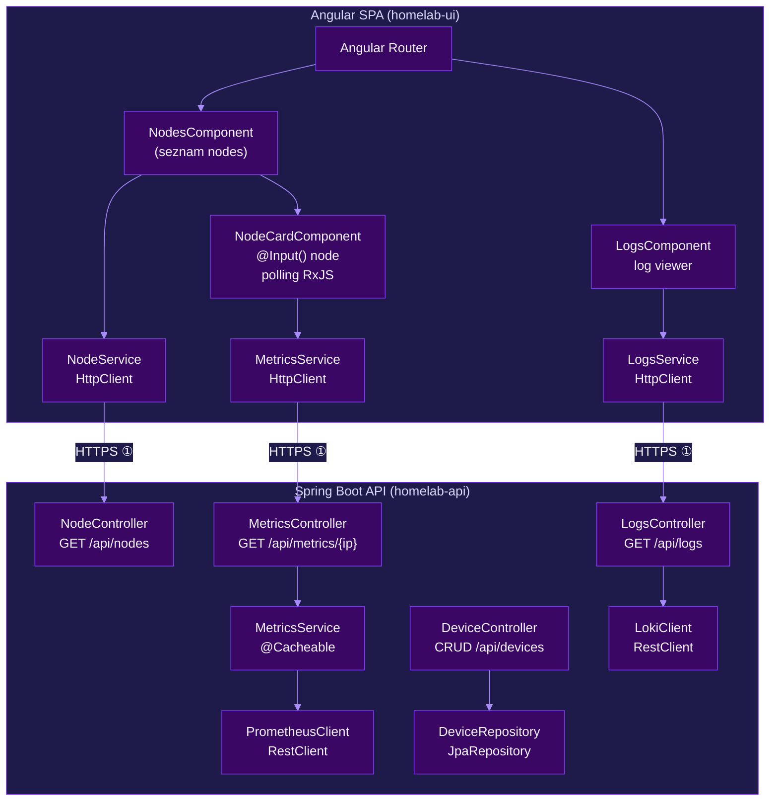
```mermaid
%%{init: {'theme': 'base', 'themeVariables': {'primaryColor': '#3b0764', 'primaryTextColor': '#f5f3ff', 'primaryBorderColor': '#7c3aed', 'lineColor': '#a78bfa', 'secondaryColor': '#1f2937', 'tertiaryColor': '#111827', 'clusterBkg': '#1e1b4b', 'clusterBorder': '#6d28d9', 'nodeBorder': '#7c3aed', 'titleColor': '#ddd6fe', 'edgeLabelBackground': '#1e1b4b', 'actorBkg': '#3b0764', 'actorBorder': '#7c3aed', 'actorTextColor': '#f5f3ff', 'actorLineColor': '#6d28d9', 'signalColor': '#a78bfa', 'signalTextColor': '#f5f3ff', 'noteBkgColor': '#2e1065', 'noteTextColor': '#ddd6fe', 'labelBoxBkgColor': '#3b0764', 'labelBoxBorderColor': '#7c3aed', 'labelTextColor': '#f5f3ff', 'loopTextColor': '#ddd6fe', 'activationBorderColor': '#7c3aed', 'activationBkgColor': '#2e1065', 'sequenceNumberColor': '#f5f3ff'}}}%%
graph TB
    subgraph Frontend["Angular SPA  (homelab-ui)"]
        direction LR
        Router["Angular Router"]
        NodesCmp["NodesComponent\n(seznam nodes)"]
        NodeCard["NodeCardComponent\n@Input() node\npolling RxJS"]
        LogsCmp["LogsComponent\nlog viewer"]
        NodeSvc["NodeService\nHttpClient"]
        MetSvc["MetricsService\nHttpClient"]
        LogSvc["LogsService\nHttpClient"]

        Router --> NodesCmp & LogsCmp
        NodesCmp --> NodeCard
        NodeCard --> MetSvc
        NodesCmp --> NodeSvc
        LogsCmp --> LogSvc
    end

    subgraph Backend["Spring Boot API  (homelab-api)"]
        direction TB
        NodeCtrl["NodeController\nGET /api/nodes"]
        MetCtrl["MetricsController\nGET /api/metrics/{ip}"]
        DevCtrl["DeviceController\nCRUD /api/devices"]
        LogCtrl["LogsController\nGET /api/logs"]

        MetSvcBE["MetricsService\n@Cacheable"]
        PromClient["PrometheusClient\nRestClient"]
        LokiClient["LokiClient\nRestClient"]
        DevRepo["DeviceRepository\nJpaRepository"]
    end

    NodeSvc -->|"HTTPS ①"| NodeCtrl
    MetSvc -->|"HTTPS ①"| MetCtrl
    LogSvc -->|"HTTPS ①"| LogCtrl

    MetCtrl --> MetSvcBE
    MetSvcBE --> PromClient
    LogCtrl --> LokiClient
    DevCtrl --> DevRepo
```

> ① **HTTPS** – `homelab.local` má TLS certifikát vydaný přes cert-manager (homelab-ca ClusterIssuer, stejná CA jako pro registry). HTTP požadavky jsou automaticky přesměrovány na HTTPS (`ssl-redirect: true`).  
> Intra-cluster komunikace (Ingress → pod) je HTTP – TLS se terminuje na Ingressu. Cluster síť je považována za důvěryhodnou.

### Technologický stack


```mermaid
%%{init: {'theme': 'base', 'themeVariables': {'primaryColor': '#3b0764', 'primaryTextColor': '#f5f3ff', 'primaryBorderColor': '#7c3aed', 'lineColor': '#a78bfa', 'secondaryColor': '#1f2937', 'tertiaryColor': '#111827', 'clusterBkg': '#1e1b4b', 'clusterBorder': '#6d28d9', 'nodeBorder': '#7c3aed', 'titleColor': '#ddd6fe', 'edgeLabelBackground': '#1e1b4b', 'actorBkg': '#3b0764', 'actorBorder': '#7c3aed', 'actorTextColor': '#f5f3ff', 'actorLineColor': '#6d28d9', 'signalColor': '#a78bfa', 'signalTextColor': '#f5f3ff', 'noteBkgColor': '#2e1065', 'noteTextColor': '#ddd6fe', 'labelBoxBkgColor': '#3b0764', 'labelBoxBorderColor': '#7c3aed', 'labelTextColor': '#f5f3ff', 'loopTextColor': '#ddd6fe', 'activationBorderColor': '#7c3aed', 'activationBkgColor': '#2e1065', 'sequenceNumberColor': '#f5f3ff'}}}%%
graph LR
    subgraph FE["Frontend"]
        A17["Angular\nComponent-based SPA"]
        AM["Angular Material\nUI komponenty"]
        RxJS["RxJS\nReaktivní polling"]
        TS["TypeScript"]
    end

    subgraph BE["Backend"]
        SB["Spring Boot\nREST API"]
        J21["Java 21\nrecords, virtual threads"]
        JPA["Spring Data JPA\nORM + Flyway"]
        SC["Spring Cache\n@Cacheable"]
        RC["RestClient\nHTTP integrace"]
    end

    subgraph Infra["Infrastructure"]
        PG["PostgreSQL\nRelační data"]
        RD["Redis\nIn-memory cache"]
        PR["Prometheus\nTime-series metriky"]
        LK["Loki\nLog aggregace"]
    end

    FE -->|HTTP/JSON| BE
    BE --> Infra
```

---

## 5. Datová vrstva

### Datový model

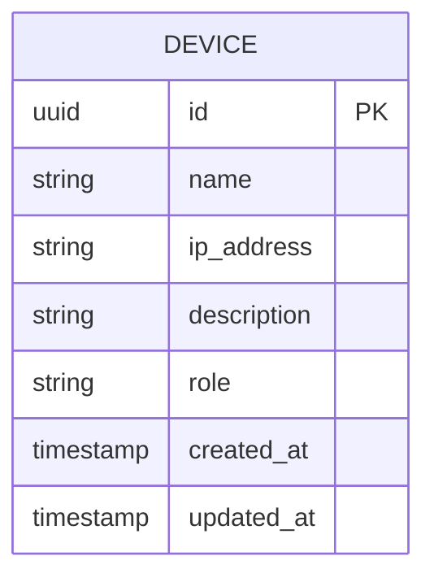
```mermaid
erDiagram
    DEVICE {
        uuid id PK
        string name
        string ip_address
        string description
        string role
        timestamp created_at
        timestamp updated_at
    }
```

### Cache strategie

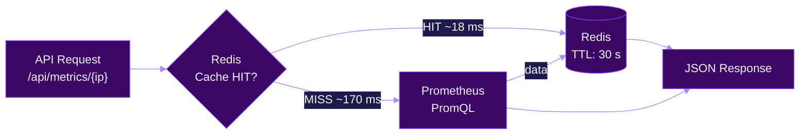
```mermaid
%%{init: {'theme': 'base', 'themeVariables': {'primaryColor': '#3b0764', 'primaryTextColor': '#f5f3ff', 'primaryBorderColor': '#7c3aed', 'lineColor': '#a78bfa', 'secondaryColor': '#1f2937', 'tertiaryColor': '#111827', 'clusterBkg': '#1e1b4b', 'clusterBorder': '#6d28d9', 'nodeBorder': '#7c3aed', 'titleColor': '#ddd6fe', 'edgeLabelBackground': '#1e1b4b', 'actorBkg': '#3b0764', 'actorBorder': '#7c3aed', 'actorTextColor': '#f5f3ff', 'actorLineColor': '#6d28d9', 'signalColor': '#a78bfa', 'signalTextColor': '#f5f3ff', 'noteBkgColor': '#2e1065', 'noteTextColor': '#ddd6fe', 'labelBoxBkgColor': '#3b0764', 'labelBoxBorderColor': '#7c3aed', 'labelTextColor': '#f5f3ff', 'loopTextColor': '#ddd6fe', 'activationBorderColor': '#7c3aed', 'activationBkgColor': '#2e1065', 'sequenceNumberColor': '#f5f3ff'}}}%%
graph LR
    Request["API Request\n/api/metrics/{ip}"]
    Check{"Redis\nCache HIT?"}
    Redis[("Redis\nTTL: 30 s")]
    Prom["Prometheus\nPromQL"]
    Response["JSON Response"]

    Request --> Check
    Check -->|HIT ~18 ms| Redis
    Check -->|MISS ~170 ms| Prom
    Prom -->|data| Redis
    Redis --> Response
    Prom --> Response
```

---

## 6. Platform Services

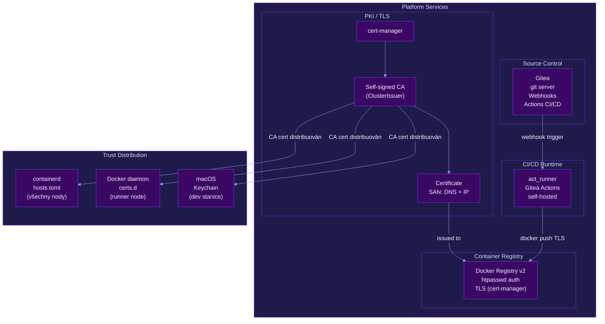
```mermaid
%%{init: {'theme': 'base', 'themeVariables': {'primaryColor': '#3b0764', 'primaryTextColor': '#f5f3ff', 'primaryBorderColor': '#7c3aed', 'lineColor': '#a78bfa', 'secondaryColor': '#1f2937', 'tertiaryColor': '#111827', 'clusterBkg': '#1e1b4b', 'clusterBorder': '#6d28d9', 'nodeBorder': '#7c3aed', 'titleColor': '#ddd6fe', 'edgeLabelBackground': '#1e1b4b', 'actorBkg': '#3b0764', 'actorBorder': '#7c3aed', 'actorTextColor': '#f5f3ff', 'actorLineColor': '#6d28d9', 'signalColor': '#a78bfa', 'signalTextColor': '#f5f3ff', 'noteBkgColor': '#2e1065', 'noteTextColor': '#ddd6fe', 'labelBoxBkgColor': '#3b0764', 'labelBoxBorderColor': '#7c3aed', 'labelTextColor': '#f5f3ff', 'loopTextColor': '#ddd6fe', 'activationBorderColor': '#7c3aed', 'activationBkgColor': '#2e1065', 'sequenceNumberColor': '#f5f3ff'}}}%%
graph TB
    subgraph PS["Platform Services"]
        direction TB

        subgraph SCM["Source Control"]
            Gitea["Gitea\ngit server\nWebhooks\nActions CI/CD"]
        end

        subgraph Registry["Container Registry"]
            Reg["Docker Registry v2\nhtpasswd auth\nTLS (cert-manager)"]
        end

        subgraph PKI["PKI / TLS"]
            CM["cert-manager"]
            CA["Self-signed CA\n(ClusterIssuer)"]
            Cert["Certificate\nSAN: DNS + IP"]
            CM --> CA --> Cert
            Cert -->|issued to| Reg
        end

        subgraph Runner["CI/CD Runtime"]
            ActRunner["act_runner\nGitea Actions\nself-hosted"]
        end
    end

    subgraph Trust["Trust Distribution"]
        ContainerD["containerd\nhosts.toml\n(všechny nody)"]
        DockerDaemon["Docker daemon\ncerts.d\n(runner node)"]
        MacOS["macOS\nKeychain\n(dev stanice)"]
    end

    Gitea -->|webhook trigger| ActRunner
    ActRunner -->|docker push TLS| Reg
    CA -->|CA cert distribuován| ContainerD & DockerDaemon & MacOS
```

---

## 7. CI/CD Pipeline

### Workflow

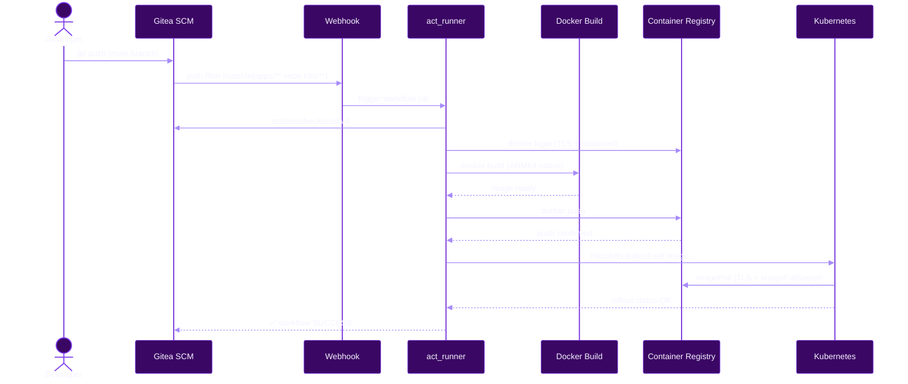
```mermaid
%%{init: {'theme': 'base', 'themeVariables': {'primaryColor': '#3b0764', 'primaryTextColor': '#f5f3ff', 'primaryBorderColor': '#7c3aed', 'lineColor': '#a78bfa', 'secondaryColor': '#1f2937', 'tertiaryColor': '#111827', 'clusterBkg': '#1e1b4b', 'clusterBorder': '#6d28d9', 'nodeBorder': '#7c3aed', 'titleColor': '#ddd6fe', 'edgeLabelBackground': '#1e1b4b', 'actorBkg': '#3b0764', 'actorBorder': '#7c3aed', 'actorTextColor': '#f5f3ff', 'actorLineColor': '#6d28d9', 'signalColor': '#a78bfa', 'signalTextColor': '#f5f3ff', 'noteBkgColor': '#2e1065', 'noteTextColor': '#ddd6fe', 'labelBoxBkgColor': '#3b0764', 'labelBoxBorderColor': '#7c3aed', 'labelTextColor': '#f5f3ff', 'loopTextColor': '#ddd6fe', 'activationBorderColor': '#7c3aed', 'activationBkgColor': '#2e1065', 'sequenceNumberColor': '#f5f3ff'}}}%%
sequenceDiagram
    actor Dev as Developer
    participant Git as Gitea SCM
    participant Hook as Webhook
    participant Runner as act_runner
    participant Build as Docker Build
    participant Reg as Container Registry
    participant K8s as Kubernetes

    Dev->>Git: git push (main branch)
    Git->>Hook: path filter match\n(apps/** nebo k8s/**)
    Hook->>Runner: trigger workflow job
    Runner->>Git: actions/checkout@v4
    Runner->>Reg: docker login (TLS + htpasswd)
    Runner->>Build: docker build (ARM64 native)
    Build-->>Runner: image ready
    Runner->>Reg: docker push
    Reg-->>Runner: push confirmed
    Runner->>K8s: microk8s kubectl set image
    K8s->>Reg: imagePull (TLS + imagePullSecret)
    K8s-->>Runner: rollout status OK
    Runner-->>Git: ✅ workflow SUCCESS
```

### Path-based triggering

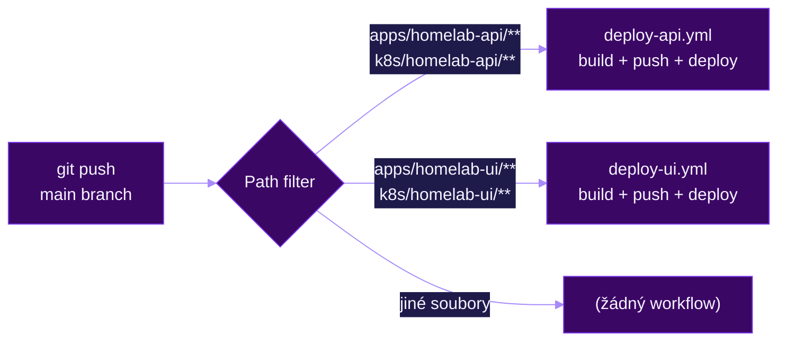
```mermaid
%%{init: {'theme': 'base', 'themeVariables': {'primaryColor': '#3b0764', 'primaryTextColor': '#f5f3ff', 'primaryBorderColor': '#7c3aed', 'lineColor': '#a78bfa', 'secondaryColor': '#1f2937', 'tertiaryColor': '#111827', 'clusterBkg': '#1e1b4b', 'clusterBorder': '#6d28d9', 'nodeBorder': '#7c3aed', 'titleColor': '#ddd6fe', 'edgeLabelBackground': '#1e1b4b', 'actorBkg': '#3b0764', 'actorBorder': '#7c3aed', 'actorTextColor': '#f5f3ff', 'actorLineColor': '#6d28d9', 'signalColor': '#a78bfa', 'signalTextColor': '#f5f3ff', 'noteBkgColor': '#2e1065', 'noteTextColor': '#ddd6fe', 'labelBoxBkgColor': '#3b0764', 'labelBoxBorderColor': '#7c3aed', 'labelTextColor': '#f5f3ff', 'loopTextColor': '#ddd6fe', 'activationBorderColor': '#7c3aed', 'activationBkgColor': '#2e1065', 'sequenceNumberColor': '#f5f3ff'}}}%%
graph LR
    Push["git push\nmain branch"]

    Push --> Filter{Path filter}
    Filter -->|"apps/homelab-api/**\nk8s/homelab-api/**"| WF_API["deploy-api.yml\nbuild + push + deploy"]
    Filter -->|"apps/homelab-ui/**\nk8s/homelab-ui/**"| WF_UI["deploy-ui.yml\nbuild + push + deploy"]
    Filter -->|"jiné soubory"| Skip["(žádný workflow)"]
```

---

## 8. Observability

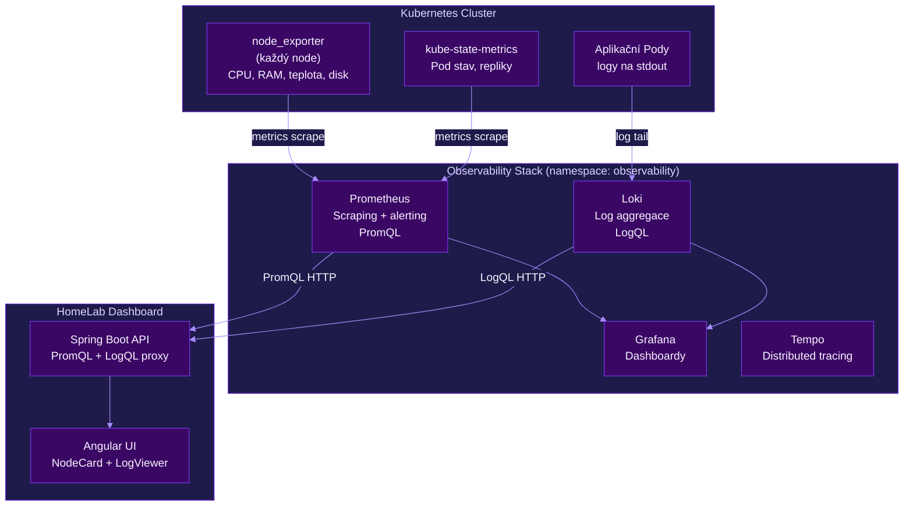
```mermaid
%%{init: {'theme': 'base', 'themeVariables': {'primaryColor': '#3b0764', 'primaryTextColor': '#f5f3ff', 'primaryBorderColor': '#7c3aed', 'lineColor': '#a78bfa', 'secondaryColor': '#1f2937', 'tertiaryColor': '#111827', 'clusterBkg': '#1e1b4b', 'clusterBorder': '#6d28d9', 'nodeBorder': '#7c3aed', 'titleColor': '#ddd6fe', 'edgeLabelBackground': '#1e1b4b', 'actorBkg': '#3b0764', 'actorBorder': '#7c3aed', 'actorTextColor': '#f5f3ff', 'actorLineColor': '#6d28d9', 'signalColor': '#a78bfa', 'signalTextColor': '#f5f3ff', 'noteBkgColor': '#2e1065', 'noteTextColor': '#ddd6fe', 'labelBoxBkgColor': '#3b0764', 'labelBoxBorderColor': '#7c3aed', 'labelTextColor': '#f5f3ff', 'loopTextColor': '#ddd6fe', 'activationBorderColor': '#7c3aed', 'activationBkgColor': '#2e1065', 'sequenceNumberColor': '#f5f3ff'}}}%%
graph TB
    subgraph Cluster["Kubernetes Cluster"]
        NE["node_exporter\n(každý node)\nCPU, RAM, teplota, disk"]
        KSM["kube-state-metrics\nPod stav, repliky"]
        Pods["Aplikační Pody\nlogy na stdout"]
    end

    subgraph ObsStack["Observability Stack  (namespace: observability)"]
        Prom["Prometheus\nScraping + alerting\nPromQL"]
        Loki["Loki\nLog aggregace\nLogQL"]
        Grafana["Grafana\nDashboardy"]
        Tempo["Tempo\nDistributed tracing"]
    end

    subgraph Dashboard["HomeLab Dashboard"]
        API["Spring Boot API\nPromQL + LogQL proxy"]
        UI["Angular UI\nNodeCard + LogViewer"]
    end

    NE -->|metrics scrape| Prom
    KSM -->|metrics scrape| Prom
    Pods -->|log tail| Loki
    Prom --> Grafana
    Loki --> Grafana

    Prom -->|PromQL HTTP| API
    Loki -->|LogQL HTTP| API
    API --> UI
```

**Metriky exponované dashboardem:**

| Metrika | Zdroj | PromQL |
|---|---|---|
| CPU utilization | node_exporter | `100 - avg(irate(node_cpu_seconds_total{mode="idle"}[5m])) * 100` |
| Memory usage | node_exporter | `(1 - node_memory_MemAvailable_bytes / node_memory_MemTotal_bytes) * 100` |
| Temperature | node_exporter | `node_hwmon_temp_celsius` |

---

## 9. Security

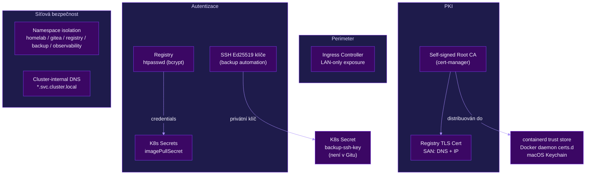
```mermaid
%%{init: {'theme': 'base', 'themeVariables': {'primaryColor': '#3b0764', 'primaryTextColor': '#f5f3ff', 'primaryBorderColor': '#7c3aed', 'lineColor': '#a78bfa', 'secondaryColor': '#1f2937', 'tertiaryColor': '#111827', 'clusterBkg': '#1e1b4b', 'clusterBorder': '#6d28d9', 'nodeBorder': '#7c3aed', 'titleColor': '#ddd6fe', 'edgeLabelBackground': '#1e1b4b', 'actorBkg': '#3b0764', 'actorBorder': '#7c3aed', 'actorTextColor': '#f5f3ff', 'actorLineColor': '#6d28d9', 'signalColor': '#a78bfa', 'signalTextColor': '#f5f3ff', 'noteBkgColor': '#2e1065', 'noteTextColor': '#ddd6fe', 'labelBoxBkgColor': '#3b0764', 'labelBoxBorderColor': '#7c3aed', 'labelTextColor': '#f5f3ff', 'loopTextColor': '#ddd6fe', 'activationBorderColor': '#7c3aed', 'activationBkgColor': '#2e1065', 'sequenceNumberColor': '#f5f3ff'}}}%%
graph TB
    subgraph Perimeter["Perimeter"]
        Ingress["Ingress Controller\nLAN-only exposure"]
    end

    subgraph PKI["PKI"]
        CA["Self-signed Root CA\n(cert-manager)"]
        RegCert["Registry TLS Cert\nSAN: DNS + IP"]
        CA --> RegCert
    end

    subgraph Auth["Autentizace"]
        RegAuth["Registry\nhtpasswd (bcrypt)"]
        K8sSec["K8s Secrets\nimagePullSecret"]
        SSHKey["SSH Ed25519 klíče\n(backup automation)"]
    end

    subgraph Network["Síťová bezpečnost"]
        NS["Namespace isolation\nhomelab / gitea / registry / backup / observability"]
        ClusterDNS["Cluster-internal DNS\n*.svc.cluster.local"]
    end

    CA -->|distribuován do| Trust["containerd trust store\nDocker daemon certs.d\nmacOS Keychain"]
    RegAuth -->|credentials| K8sSec
    SSHKey -->|privátní klíč| K8sSec2["K8s Secret\nbackup-ssh-key\n(není v Gitu)"]
```

**Principy:**
- Privátní klíče se nikdy necommitují do Gitu – pouze K8s Secrets
- TLS pro veškerou komunikaci s registry (self-signed CA s distribucí do trust stores)
- Registry autentizace bcrypt – žádné plain-text credentials
- Namespace isolation – každá služba ve vlastním namespace

---

## 10. Backup & Recovery

### Zálohovací architektura

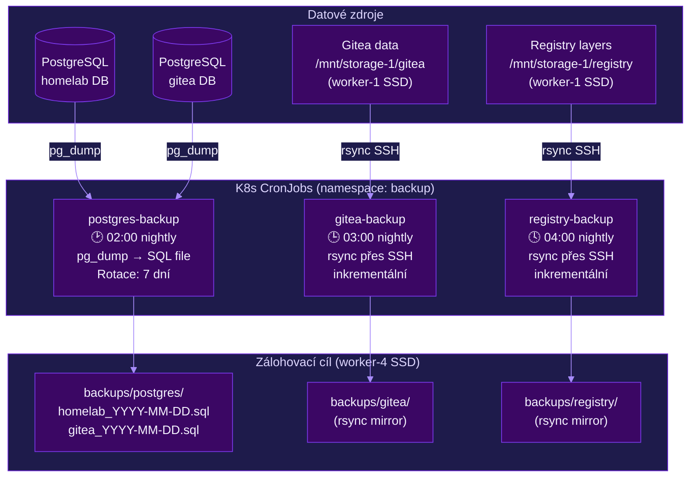
```mermaid
%%{init: {'theme': 'base', 'themeVariables': {'primaryColor': '#3b0764', 'primaryTextColor': '#f5f3ff', 'primaryBorderColor': '#7c3aed', 'lineColor': '#a78bfa', 'secondaryColor': '#1f2937', 'tertiaryColor': '#111827', 'clusterBkg': '#1e1b4b', 'clusterBorder': '#6d28d9', 'nodeBorder': '#7c3aed', 'titleColor': '#ddd6fe', 'edgeLabelBackground': '#1e1b4b', 'actorBkg': '#3b0764', 'actorBorder': '#7c3aed', 'actorTextColor': '#f5f3ff', 'actorLineColor': '#6d28d9', 'signalColor': '#a78bfa', 'signalTextColor': '#f5f3ff', 'noteBkgColor': '#2e1065', 'noteTextColor': '#ddd6fe', 'labelBoxBkgColor': '#3b0764', 'labelBoxBorderColor': '#7c3aed', 'labelTextColor': '#f5f3ff', 'loopTextColor': '#ddd6fe', 'activationBorderColor': '#7c3aed', 'activationBkgColor': '#2e1065', 'sequenceNumberColor': '#f5f3ff'}}}%%
graph TB
    subgraph Sources["Datové zdroje"]
        PG1[("PostgreSQL\nhomelab DB")]
        PG2[("PostgreSQL\ngitea DB")]
        GitData["Gitea data\n/mnt/storage-1/gitea\n(worker-1 SSD)"]
        RegData["Registry layers\n/mnt/storage-1/registry\n(worker-1 SSD)"]
    end

    subgraph CronJobs["K8s CronJobs  (namespace: backup)"]
        CJ1["postgres-backup\n🕑 02:00 nightly\npg_dump → SQL file\nRotace: 7 dní"]
        CJ2["gitea-backup\n🕒 03:00 nightly\nrsync přes SSH\ninkrementální"]
        CJ3["registry-backup\n🕓 04:00 nightly\nrsync přes SSH\ninkrementální"]
    end

    subgraph Target["Zálohovací cíl  (worker-4 SSD)"]
        BkpPG["backups/postgres/\nhomelab_YYYY-MM-DD.sql\ngitea_YYYY-MM-DD.sql"]
        BkpGit["backups/gitea/\n(rsync mirror)"]
        BkpReg["backups/registry/\n(rsync mirror)"]
    end

    PG1 -->|pg_dump| CJ1
    PG2 -->|pg_dump| CJ1
    GitData -->|rsync SSH| CJ2
    RegData -->|rsync SSH| CJ3

    CJ1 --> BkpPG
    CJ2 --> BkpGit
    CJ3 --> BkpReg
```

### Fyzické umístění storage

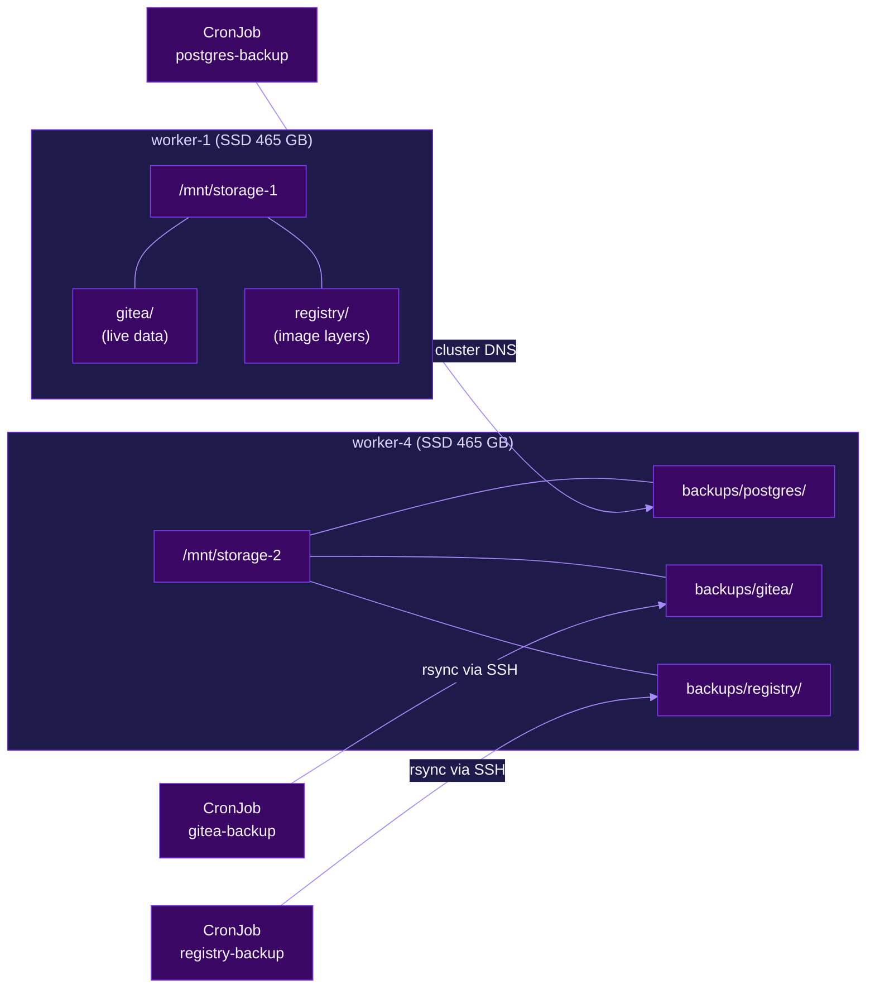
```mermaid
%%{init: {'theme': 'base', 'themeVariables': {'primaryColor': '#3b0764', 'primaryTextColor': '#f5f3ff', 'primaryBorderColor': '#7c3aed', 'lineColor': '#a78bfa', 'secondaryColor': '#1f2937', 'tertiaryColor': '#111827', 'clusterBkg': '#1e1b4b', 'clusterBorder': '#6d28d9', 'nodeBorder': '#7c3aed', 'titleColor': '#ddd6fe', 'edgeLabelBackground': '#1e1b4b', 'actorBkg': '#3b0764', 'actorBorder': '#7c3aed', 'actorTextColor': '#f5f3ff', 'actorLineColor': '#6d28d9', 'signalColor': '#a78bfa', 'signalTextColor': '#f5f3ff', 'noteBkgColor': '#2e1065', 'noteTextColor': '#ddd6fe', 'labelBoxBkgColor': '#3b0764', 'labelBoxBorderColor': '#7c3aed', 'labelTextColor': '#f5f3ff', 'loopTextColor': '#ddd6fe', 'activationBorderColor': '#7c3aed', 'activationBkgColor': '#2e1065', 'sequenceNumberColor': '#f5f3ff'}}}%%
graph LR
    subgraph W1["worker-1  (SSD 465 GB)"]
        SSD1["/mnt/storage-1"]
        SSD1 --- G["gitea/\n(live data)"]
        SSD1 --- R["registry/\n(image layers)"]
    end

    subgraph W4["worker-4  (SSD 465 GB)"]
        SSD2["/mnt/storage-2"]
        SSD2 --- BP["backups/postgres/"]
        SSD2 --- BG["backups/gitea/"]
        SSD2 --- BR["backups/registry/"]
    end

    CJ2["CronJob\ngitea-backup"] -->|rsync via SSH| BG
    CJ3["CronJob\nregistry-backup"] -->|rsync via SSH| BR
    CJ1["CronJob\npostgres-backup"] -->|pg_dump via cluster DNS| BP
```

---

## 11. Resilience & High Availability

### 11.1 Přehled implementovaných vzorů

| Vzor | Kde je implementován | Co zajišťuje |
|---|---|---|
| **Control Plane HA** | 3× etcd + API Server (Raft consensus) | Cluster řídí i při výpadku 1 masteru |
| **Self-healing** | Kubernetes ReplicaSet + restart policy | Automatický restart selhaného podu |
| **Health Probes** | readinessProbe + livenessProbe na API | Žádný traffic na unhealthy pod |
| **Rolling Update** | Deployment strategy (výchozí K8s) | Zero-downtime deploy |
| **Cache Resilience** | Redis + `@Cacheable` TTL 30 s | Funkční API i při pomalém/nedostupném Prometheus |
| **Data Durability** | PVC `Retain` policy | Data přežijí smazání podu i PVC |
| **Namespace Isolation** | 6 oddělených namespace | Blast radius – selhání jedné služby neovlivní ostatní |
| **Backup & Recovery** | K8s CronJobs + rsync na dedikovaný node | RPO ≤ 24 h, data na fyzicky oddělené SSD |
| **Node Affinity** | PV nodeAffinity na konkrétní worker | Deterministické umístění dat |

---

### 11.2 Control Plane HA – etcd Raft

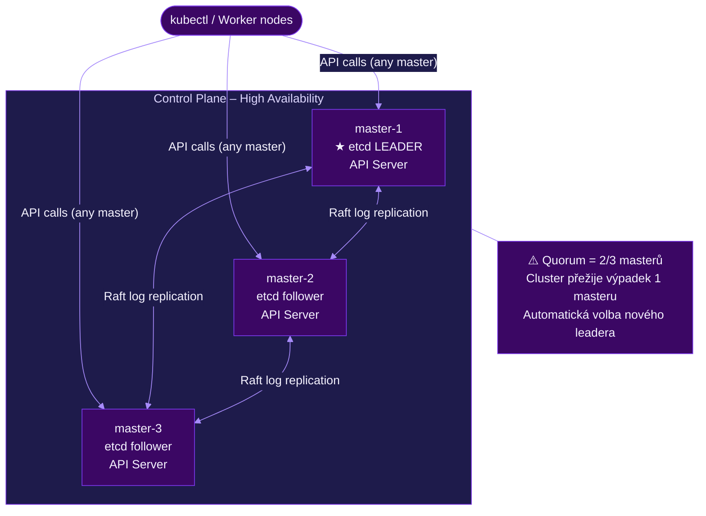
```mermaid
%%{init: {'theme': 'base', 'themeVariables': {'primaryColor': '#3b0764', 'primaryTextColor': '#f5f3ff', 'primaryBorderColor': '#7c3aed', 'lineColor': '#a78bfa', 'secondaryColor': '#1f2937', 'tertiaryColor': '#111827', 'clusterBkg': '#1e1b4b', 'clusterBorder': '#6d28d9', 'nodeBorder': '#7c3aed', 'titleColor': '#ddd6fe', 'edgeLabelBackground': '#1e1b4b', 'actorBkg': '#3b0764', 'actorBorder': '#7c3aed', 'actorTextColor': '#f5f3ff', 'actorLineColor': '#6d28d9', 'signalColor': '#a78bfa', 'signalTextColor': '#f5f3ff', 'noteBkgColor': '#2e1065', 'noteTextColor': '#ddd6fe', 'labelBoxBkgColor': '#3b0764', 'labelBoxBorderColor': '#7c3aed', 'labelTextColor': '#f5f3ff', 'loopTextColor': '#ddd6fe', 'activationBorderColor': '#7c3aed', 'activationBkgColor': '#2e1065', 'sequenceNumberColor': '#f5f3ff'}}}%%
graph TB
    subgraph CP["Control Plane – High Availability"]
        M1["master-1\n★ etcd LEADER\nAPI Server"]
        M2["master-2\netcd follower\nAPI Server"]
        M3["master-3\netcd follower\nAPI Server"]

        M1 <-->|"Raft log replication"| M2
        M2 <-->|"Raft log replication"| M3
        M1 <-->|"Raft log replication"| M3
    end

    Client(["kubectl / Worker nodes"])
    Client -->|"API calls (any master)"| M1
    Client -->|"API calls (any master)"| M2
    Client -->|"API calls (any master)"| M3

    Note1["⚠️ Quorum = 2/3 masterů\nCluster přežije výpadek 1 masteru\nAutomatická volba nového leadera"]
    CP --- Note1
```

**Vlastnosti etcd Raft v tomto clusteru:**
- Quorum = ⌊3/2⌋ + 1 = **2 nody** – cluster funguje i při výpadku 1 masteru
- Automatická leader election bez manuálního zásahu
- Write operace jdou přes leadera, read lze z libovolného followera

---

### 11.3 Kubernetes Self-Healing

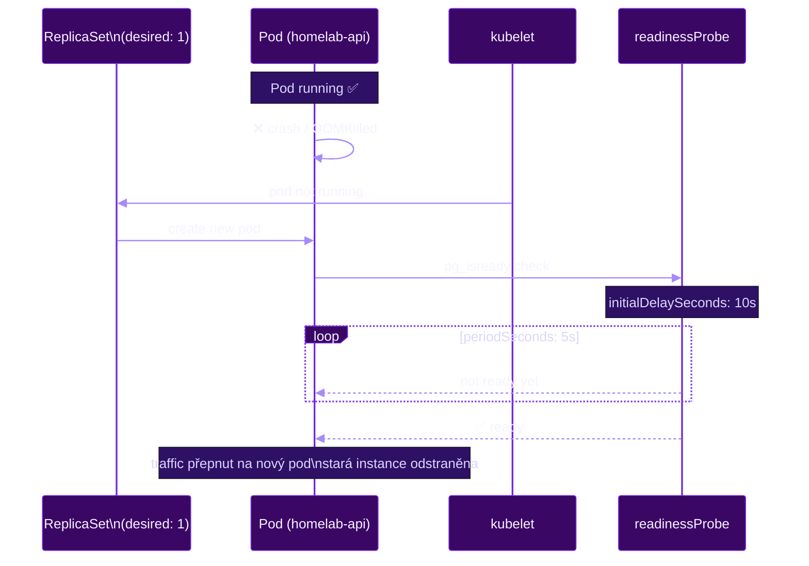
```mermaid
%%{init: {'theme': 'base', 'themeVariables': {'primaryColor': '#3b0764', 'primaryTextColor': '#f5f3ff', 'primaryBorderColor': '#7c3aed', 'lineColor': '#a78bfa', 'secondaryColor': '#1f2937', 'tertiaryColor': '#111827', 'clusterBkg': '#1e1b4b', 'clusterBorder': '#6d28d9', 'nodeBorder': '#7c3aed', 'titleColor': '#ddd6fe', 'edgeLabelBackground': '#1e1b4b', 'actorBkg': '#3b0764', 'actorBorder': '#7c3aed', 'actorTextColor': '#f5f3ff', 'actorLineColor': '#6d28d9', 'signalColor': '#a78bfa', 'signalTextColor': '#f5f3ff', 'noteBkgColor': '#2e1065', 'noteTextColor': '#ddd6fe', 'labelBoxBkgColor': '#3b0764', 'labelBoxBorderColor': '#7c3aed', 'labelTextColor': '#f5f3ff', 'loopTextColor': '#ddd6fe', 'activationBorderColor': '#7c3aed', 'activationBkgColor': '#2e1065', 'sequenceNumberColor': '#f5f3ff'}}}%%
sequenceDiagram
    participant RS as ReplicaSet\n(desired: 1)
    participant Pod as Pod (homelab-api)
    participant K8s as kubelet
    participant Probe as readinessProbe

    Note over Pod: Pod running ✅

    Pod->>Pod: ❌ crash / OOMKilled
    K8s->>RS: pod not running
    RS->>Pod: create new pod
    Pod->>Probe: pg_isready check
    Note over Probe: initialDelaySeconds: 10s
    loop periodSeconds: 5s
        Probe-->>Pod: not ready yet
    end
    Probe-->>Pod: ✅ ready
    Note over Pod: traffic přepnut na nový pod\nstará instance odstraněna
```

**Konfigurace health probes (homelab-api):**
```
readinessProbe:
  exec: pg_isready         ← pod přijímá traffic až po připojení k DB
  initialDelay: 10s
  period: 5s

livenessProbe:
  httpGet: /actuator/health ← kubelet restartuje pod pokud přestane odpovídat
```

---

### 11.4 Zero-Downtime Deploy – Rolling Update

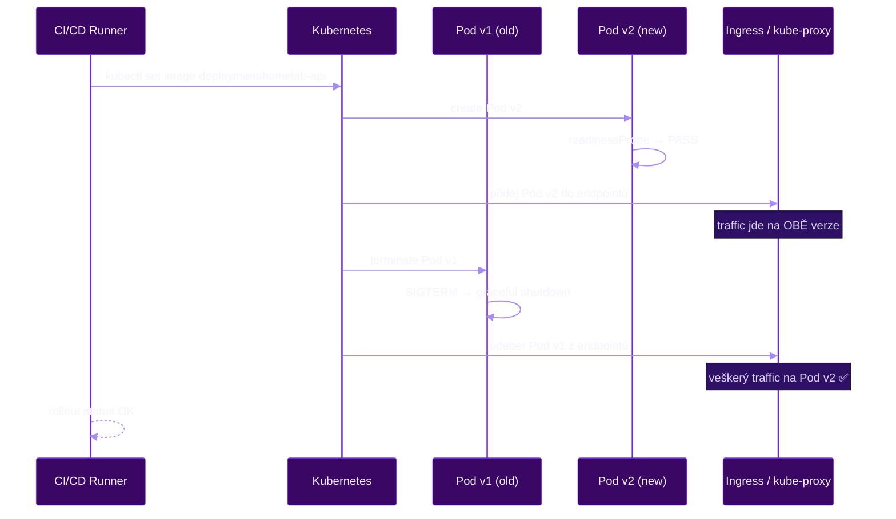
```mermaid
%%{init: {'theme': 'base', 'themeVariables': {'primaryColor': '#3b0764', 'primaryTextColor': '#f5f3ff', 'primaryBorderColor': '#7c3aed', 'lineColor': '#a78bfa', 'secondaryColor': '#1f2937', 'tertiaryColor': '#111827', 'clusterBkg': '#1e1b4b', 'clusterBorder': '#6d28d9', 'nodeBorder': '#7c3aed', 'titleColor': '#ddd6fe', 'edgeLabelBackground': '#1e1b4b', 'actorBkg': '#3b0764', 'actorBorder': '#7c3aed', 'actorTextColor': '#f5f3ff', 'actorLineColor': '#6d28d9', 'signalColor': '#a78bfa', 'signalTextColor': '#f5f3ff', 'noteBkgColor': '#2e1065', 'noteTextColor': '#ddd6fe', 'labelBoxBkgColor': '#3b0764', 'labelBoxBorderColor': '#7c3aed', 'labelTextColor': '#f5f3ff', 'loopTextColor': '#ddd6fe', 'activationBorderColor': '#7c3aed', 'activationBkgColor': '#2e1065', 'sequenceNumberColor': '#f5f3ff'}}}%%
sequenceDiagram
    participant CI as CI/CD Runner
    participant K8s as Kubernetes
    participant OldPod as Pod v1 (old)
    participant NewPod as Pod v2 (new)
    participant LB as Ingress / kube-proxy

    CI->>K8s: kubectl set image deployment/homelab-api
    K8s->>NewPod: create Pod v2
    NewPod->>NewPod: readinessProbe → PASS
    K8s->>LB: přidej Pod v2 do endpointů
    Note over LB: traffic jde na OBĚ verze
    K8s->>OldPod: terminate Pod v1
    OldPod->>OldPod: SIGTERM → graceful shutdown
    K8s->>LB: odeber Pod v1 z endpointů
    Note over LB: veškerý traffic na Pod v2 ✅
    CI-->>CI: rollout status OK
```

Klíčové: nový pod musí projít readinessProbe **dříve** než je starý ukončen → žádný výpadek.

---

### 11.5 Cache Resilience – Redis jako buffer

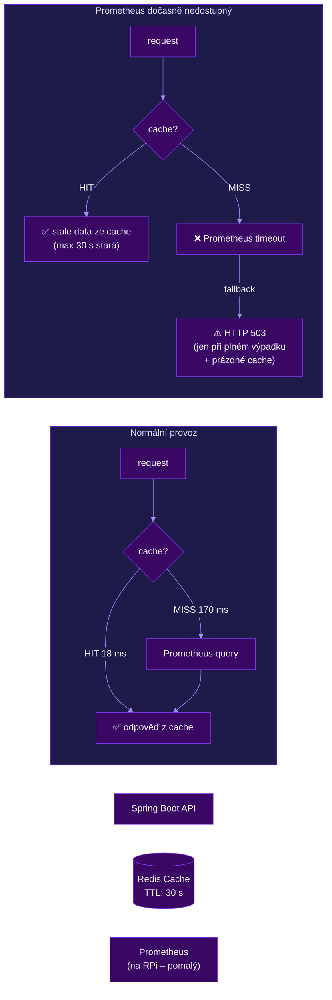
```mermaid
%%{init: {'theme': 'base', 'themeVariables': {'primaryColor': '#3b0764', 'primaryTextColor': '#f5f3ff', 'primaryBorderColor': '#7c3aed', 'lineColor': '#a78bfa', 'secondaryColor': '#1f2937', 'tertiaryColor': '#111827', 'clusterBkg': '#1e1b4b', 'clusterBorder': '#6d28d9', 'nodeBorder': '#7c3aed', 'titleColor': '#ddd6fe', 'edgeLabelBackground': '#1e1b4b', 'actorBkg': '#3b0764', 'actorBorder': '#7c3aed', 'actorTextColor': '#f5f3ff', 'actorLineColor': '#6d28d9', 'signalColor': '#a78bfa', 'signalTextColor': '#f5f3ff', 'noteBkgColor': '#2e1065', 'noteTextColor': '#ddd6fe', 'labelBoxBkgColor': '#3b0764', 'labelBoxBorderColor': '#7c3aed', 'labelTextColor': '#f5f3ff', 'loopTextColor': '#ddd6fe', 'activationBorderColor': '#7c3aed', 'activationBkgColor': '#2e1065', 'sequenceNumberColor': '#f5f3ff'}}}%%
graph LR
    API["Spring Boot API"]
    Redis[("Redis Cache\nTTL: 30 s")]
    Prom["Prometheus\n(na RPi – pomalý)"]

    subgraph Scenario1["Normální provoz"]
        A1["request"] --> C1{"cache?"}
        C1 -->|HIT 18 ms| R1["✅ odpověď z cache"]
        C1 -->|MISS 170 ms| P1["Prometheus query"]
        P1 --> R1
    end

    subgraph Scenario2["Prometheus dočasně nedostupný"]
        A2["request"] --> C2{"cache?"}
        C2 -->|HIT| R2["✅ stale data ze cache\n(max 30 s stará)"]
        C2 -->|MISS| P2["❌ Prometheus timeout"]
        P2 -->|fallback| R3["⚠️ HTTP 503\n(jen při plném výpadku\n+ prázdné cache)"]
    end
```

**Výsledek:** Krátkodobý výpadek Prometheus (< 30 s) je pro uživatele zcela transparentní díky cache. Platná data jsou vždy maximálně 30 sekund stará.

---

### 11.6 Data Durability – PersistentVolume Retain Policy

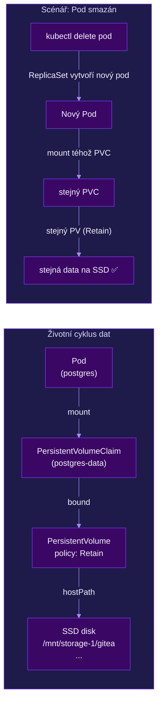
```mermaid
%%{init: {'theme': 'base', 'themeVariables': {'primaryColor': '#3b0764', 'primaryTextColor': '#f5f3ff', 'primaryBorderColor': '#7c3aed', 'lineColor': '#a78bfa', 'secondaryColor': '#1f2937', 'tertiaryColor': '#111827', 'clusterBkg': '#1e1b4b', 'clusterBorder': '#6d28d9', 'nodeBorder': '#7c3aed', 'titleColor': '#ddd6fe', 'edgeLabelBackground': '#1e1b4b', 'actorBkg': '#3b0764', 'actorBorder': '#7c3aed', 'actorTextColor': '#f5f3ff', 'actorLineColor': '#6d28d9', 'signalColor': '#a78bfa', 'signalTextColor': '#f5f3ff', 'noteBkgColor': '#2e1065', 'noteTextColor': '#ddd6fe', 'labelBoxBkgColor': '#3b0764', 'labelBoxBorderColor': '#7c3aed', 'labelTextColor': '#f5f3ff', 'loopTextColor': '#ddd6fe', 'activationBorderColor': '#7c3aed', 'activationBkgColor': '#2e1065', 'sequenceNumberColor': '#f5f3ff'}}}%%
graph LR
    subgraph Lifecycle["Životní cyklus dat"]
        direction TB
        Pod["Pod\n(postgres)"]
        PVC["PersistentVolumeClaim\n(postgres-data)"]
        PV["PersistentVolume\npolicy: Retain"]
        SSD["SSD disk\n/mnt/storage-1/gitea\n..."]

        Pod -->|mount| PVC
        PVC -->|bound| PV
        PV -->|hostPath| SSD
    end

    subgraph Failure["Scénář: Pod smazán"]
        direction TB
        Del["kubectl delete pod"] -->|"ReplicaSet vytvoří nový pod"| NewPod["Nový Pod"]
        NewPod -->|"mount téhož PVC"| SamePVC["stejný PVC"]
        SamePVC -->|"stejný PV (Retain)"| SameSSD["stejná data na SSD ✅"]
    end
```

`Retain` policy zajišťuje, že data **přežijí** smazání PVC i celého podu. Fyzický obsah SSD zůstane nedotčen.

---

### 11.7 Blast Radius – Namespace Isolation

```mermaid
%%{init: {'theme': 'base', 'themeVariables': {'primaryColor': '#3b0764', 'primaryTextColor': '#f5f3ff', 'primaryBorderColor': '#7c3aed', 'lineColor': '#a78bfa', 'secondaryColor': '#1f2937', 'tertiaryColor': '#111827', 'clusterBkg': '#1e1b4b', 'clusterBorder': '#6d28d9', 'nodeBorder': '#7c3aed', 'titleColor': '#ddd6fe', 'edgeLabelBackground': '#1e1b4b', 'actorBkg': '#3b0764', 'actorBorder': '#7c3aed', 'actorTextColor': '#f5f3ff', 'actorLineColor': '#6d28d9', 'signalColor': '#a78bfa', 'signalTextColor': '#f5f3ff', 'noteBkgColor': '#2e1065', 'noteTextColor': '#ddd6fe', 'labelBoxBkgColor': '#3b0764', 'labelBoxBorderColor': '#7c3aed', 'labelTextColor': '#f5f3ff', 'loopTextColor': '#ddd6fe', 'activationBorderColor': '#7c3aed', 'activationBkgColor': '#2e1065', 'sequenceNumberColor': '#f5f3ff'}}}%%
graph TB
    subgraph Failure["Scénář: selhání v namespace gitea"]
        GT_FAIL["gitea namespace\n❌ gitea pod crash"]
    end

    subgraph Unaffected["Ostatní namespace – NEOVLIVNĚNY"]
        HM["homelab ✅\nhomelab-api\nhomelab-ui"]
        OB["observability ✅\nPrometheus, Loki"]
        RG["registry ✅\nContainer Registry"]
        BK["backup ✅\nCronJobs"]
    end

    subgraph Shared["Sdílená infrastruktura"]
        CP["Control Plane ✅"]
        DNS["Cluster DNS ✅"]
        MLB["MetalLB ✅"]
    end

    GT_FAIL -.->|"izolováno\nnetwork policy"| HM
    GT_FAIL -.->|"izolováno"| OB
    GT_FAIL -.->|"izolováno"| RG
    GT_FAIL -.->|"izolováno"| BK
    CP & DNS & MLB -->|"sdílené, nezávislé"| HM & OB & RG & BK
```

---

### 11.8 Known Single Points of Failure (SPOF)

> Enterprise architekti: tato sekce je záměrně upřímná. HomeLab je homelab – ne produkční systém s enterprise SLA.

| Komponenta | Typ SPOF | Riziko | Mitigace v současném stavu |
|---|---|---|---|
| **worker-1** | Fyzický node | Výpadek node = ztráta Gitea + Registry | Záloha na worker-4 (nightly rsync) |
| **PostgreSQL** | Single instance | DB down = API degraded, Gitea down | Nightly pg_dump na separátní SSD |
| **Gitea** | Single instance | SCM nedostupné | Záloha repozitářů, GitHub mirror |
| **Container Registry** | Single instance | CI/CD nelze pushovat image | K8s stále běží z posledního image (cached) |
| **act_runner** | Single instance na worker-6 | CI/CD zastaveno | Manuální deploy via kubectl |
| **Ingress Controller** | Single pod | Dashboard nedostupný | MetalLB failover na jiný node |

### Cesta k plné HA (roadmap)

```mermaid
%%{init: {'theme': 'base', 'themeVariables': {'primaryColor': '#3b0764', 'primaryTextColor': '#f5f3ff', 'primaryBorderColor': '#7c3aed', 'lineColor': '#a78bfa', 'secondaryColor': '#1f2937', 'tertiaryColor': '#111827', 'clusterBkg': '#1e1b4b', 'clusterBorder': '#6d28d9', 'nodeBorder': '#7c3aed', 'titleColor': '#ddd6fe', 'edgeLabelBackground': '#1e1b4b', 'actorBkg': '#3b0764', 'actorBorder': '#7c3aed', 'actorTextColor': '#f5f3ff', 'actorLineColor': '#6d28d9', 'signalColor': '#a78bfa', 'signalTextColor': '#f5f3ff', 'noteBkgColor': '#2e1065', 'noteTextColor': '#ddd6fe', 'labelBoxBkgColor': '#3b0764', 'labelBoxBorderColor': '#7c3aed', 'labelTextColor': '#f5f3ff', 'loopTextColor': '#ddd6fe', 'activationBorderColor': '#7c3aed', 'activationBkgColor': '#2e1065', 'sequenceNumberColor': '#f5f3ff'}}}%%
graph LR
    subgraph Now["Současný stav\n(HomeLab)"]
        N1["PostgreSQL\nreplicas: 1"]
        N2["Gitea\nreplicas: 1"]
        N3["Registry\nreplicas: 1"]
        N4["Backup\nnightly rsync"]
    end

    subgraph HA["Production HA target"]
        H1["PostgreSQL\nHA (Patroni / CloudNativePG)\nreplicas: 3, streaming replication"]
        H2["Gitea\nreplicas: N + shared storage\n(CephFS / NFS)"]
        H3["Registry\nHA + geo-replication\n(Harbor)"]
        H4["Backup\nContinuous WAL archiving\nRPO: minutes"]
    end

    N1 -.->|"Fáze 15?"| H1
    N2 -.->|"Fáze 16?"| H2
    N3 -.->|"Fáze 17?"| H3
    N4 -.->|"Fáze 15?"| H4
```

---

## 12. Vývojová cesta – Fáze

Projekt byl budován inkrementálně – každá fáze přidala novou vrstvu a byla samostatně nasaditelná.

### Přehled fází

```mermaid
%%{init: {'theme': 'base', 'themeVariables': {'primaryColor': '#3b0764', 'primaryTextColor': '#f5f3ff', 'primaryBorderColor': '#7c3aed', 'lineColor': '#a78bfa', 'secondaryColor': '#1f2937', 'tertiaryColor': '#111827', 'clusterBkg': '#1e1b4b', 'clusterBorder': '#6d28d9', 'nodeBorder': '#7c3aed', 'titleColor': '#ddd6fe', 'edgeLabelBackground': '#1e1b4b', 'actorBkg': '#3b0764', 'actorBorder': '#7c3aed', 'actorTextColor': '#f5f3ff', 'actorLineColor': '#6d28d9', 'signalColor': '#a78bfa', 'signalTextColor': '#f5f3ff', 'noteBkgColor': '#2e1065', 'noteTextColor': '#ddd6fe', 'labelBoxBkgColor': '#3b0764', 'labelBoxBorderColor': '#7c3aed', 'labelTextColor': '#f5f3ff', 'loopTextColor': '#ddd6fe', 'activationBorderColor': '#7c3aed', 'activationBkgColor': '#2e1065', 'sequenceNumberColor': '#f5f3ff'}}}%%
timeline
    title HomeLab Platform – vývojová cesta
    section Foundation
        Fáze 1 : Spring Boot REST API
               : GET /api/nodes (hardcoded)
               : Java 21, Maven, Dockerfile
        Fáze 2 : Angular frontend
               : HttpClient, NgFor, Material
               : Komponenty, Services, Observables
        Fáze 3 : Docker Compose
               : api + ui + postgres + redis
               : Multi-stage build, sítě
    section Data & Performance
        Fáze 4 : PostgreSQL + JPA
               : @Entity, Flyway migrace
               : REST CRUD /api/devices
        Fáze 5 : Prometheus integrace
               : RestClient, PromQL
               : GET /api/metrics/{ip}
        Fáze 6 : Redis cache
               : @Cacheable, TTL 30 s
               : Cache miss 170ms → hit 18ms
    section Frontend & Observability
        Fáze 7 : Angular metriky
               : NodeCardComponent, RxJS polling
               : mat-progress-bar, barevná teplota
        Fáze 8 : Kubernetes nasazení
               : Kustomize, Ingress, ARM64 build
               : Namespace homelab
        Fáze 9 : Loki log viewer
               : LogQL, tab navigace
               : GET /api/logs
    section Platform
        Fáze 10 : CI/CD – GitHub Actions
                : self-hosted runner, ARM64
                : git push → deploy
        Fáze 10.5 : Local storage
                  : SSD ext4, fstab, StorageClass
                  : PersistentVolumes s nodeAffinity
        Fáze 11 : Gitea SCM
                : lokální Git server
                : PostgreSQL backend, Ingress
        Fáze 12 : Container Registry
                : registry:2, htpasswd
                : MetalLB dedikovaná IP
        Fáze 12.5 : TLS / cert-manager
                  : Self-signed CA
                  : Certificate SAN (DNS + IP)
        Fáze 13 : Gitea Actions CI/CD
                : act_runner, migrace z GitHub
                : lokální registry pipeline
        Fáze 14 : Backup & Recovery
                : K8s CronJobs
                : pg_dump + rsync přes SSH
```

### Architekturní evoluce

```mermaid
%%{init: {'theme': 'base', 'themeVariables': {'primaryColor': '#3b0764', 'primaryTextColor': '#f5f3ff', 'primaryBorderColor': '#7c3aed', 'lineColor': '#a78bfa', 'secondaryColor': '#1f2937', 'tertiaryColor': '#111827', 'clusterBkg': '#1e1b4b', 'clusterBorder': '#6d28d9', 'nodeBorder': '#7c3aed', 'titleColor': '#ddd6fe', 'edgeLabelBackground': '#1e1b4b', 'actorBkg': '#3b0764', 'actorBorder': '#7c3aed', 'actorTextColor': '#f5f3ff', 'actorLineColor': '#6d28d9', 'signalColor': '#a78bfa', 'signalTextColor': '#f5f3ff', 'noteBkgColor': '#2e1065', 'noteTextColor': '#ddd6fe', 'labelBoxBkgColor': '#3b0764', 'labelBoxBorderColor': '#7c3aed', 'labelTextColor': '#f5f3ff', 'loopTextColor': '#ddd6fe', 'activationBorderColor': '#7c3aed', 'activationBkgColor': '#2e1065', 'sequenceNumberColor': '#f5f3ff'}}}%%
graph LR
    subgraph F1_3["Fáze 1–3: Foundation"]
        A1["REST API\n(hardcoded data)"]
        A2["Angular SPA"]
        A3["Docker Compose\ndev stack"]
    end

    subgraph F4_6["Fáze 4–6: Data"]
        B1["PostgreSQL\n+ Flyway"]
        B2["Prometheus\nintegrace"]
        B3["Redis cache\n@Cacheable"]
    end

    subgraph F7_9["Fáze 7–9: UX + Logs"]
        C1["NodeCard\n+ RxJS polling"]
        C2["K8s deploy\nKustomize"]
        C3["Loki\nlog viewer"]
    end

    subgraph F10_14["Fáze 10–14: Platform"]
        D1["CI/CD\nGitea Actions"]
        D2["Local storage\nSSD + PV"]
        D3["Gitea SCM\n+ Registry"]
        D4["TLS\ncert-manager"]
        D5["Backup\nCronJobs"]
    end

    F1_3 --> F4_6 --> F7_9 --> F10_14
```

### Klíčová architektonická rozhodnutí

| Rozhodnutí | Volba | Důvod |
|---|---|---|
| Ingress class | `public` (ne `nginx`) | MicroK8s pojmenovává Ingress Controller `public` |
| Container registry | Self-hosted + TLS | Citlivé interní images, no vendor lock-in |
| TLS strategie | cert-manager + self-signed CA | Automatická obnova, distribuce přes trust stores |
| CI/CD runner | self-hosted na clusteru | Docker daemon přístup k lokální registry bez NAT |
| Storage pro Gitea/Registry | Lokální SSD s nodeAffinity | Výkon na ARM64, není potřeba distribuovaný storage |
| Zálohovací transport | rsync přes SSH | Jednoduché, spolehlivé, žádná závislost na sdíleném storage |
| Cache invalidace | TTL 30 s + `@Scheduled` evict | Prometheus na RPi je pomalý – cacheování kritické pro UX |
| K8s distribuce | MicroK8s | Nízký overhead, snadná instalace na RPi, HA control plane |

---

## Appendix – Namespace přehled

```mermaid
%%{init: {'theme': 'base', 'themeVariables': {'primaryColor': '#3b0764', 'primaryTextColor': '#f5f3ff', 'primaryBorderColor': '#7c3aed', 'lineColor': '#a78bfa', 'secondaryColor': '#1f2937', 'tertiaryColor': '#111827', 'clusterBkg': '#1e1b4b', 'clusterBorder': '#6d28d9', 'nodeBorder': '#7c3aed', 'titleColor': '#ddd6fe', 'edgeLabelBackground': '#1e1b4b', 'actorBkg': '#3b0764', 'actorBorder': '#7c3aed', 'actorTextColor': '#f5f3ff', 'actorLineColor': '#6d28d9', 'signalColor': '#a78bfa', 'signalTextColor': '#f5f3ff', 'noteBkgColor': '#2e1065', 'noteTextColor': '#ddd6fe', 'labelBoxBkgColor': '#3b0764', 'labelBoxBorderColor': '#7c3aed', 'labelTextColor': '#f5f3ff', 'loopTextColor': '#ddd6fe', 'activationBorderColor': '#7c3aed', 'activationBkgColor': '#2e1065', 'sequenceNumberColor': '#f5f3ff'}}}%%
graph TB
    subgraph Namespaces["Kubernetes Namespaces"]
        direction LR
        HM["homelab\n── homelab-api\n── homelab-ui\n── postgres\n── redis"]
        GT["gitea\n── gitea\n── postgres"]
        RG["registry\n── registry"]
        OB["observability\n── prometheus\n── grafana\n── loki\n── tempo"]
        CM["cert-manager\n── cert-manager\n── CA secret"]
        BK["backup\n── cronjob-postgres\n── cronjob-gitea\n── cronjob-registry"]
    end
```

---

*Dokument generován: 2026-05-02*  
*Projekt: PROJEKTIL / HomeLab Dashboard*
